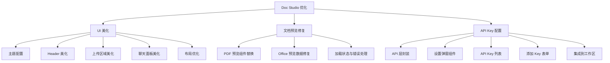
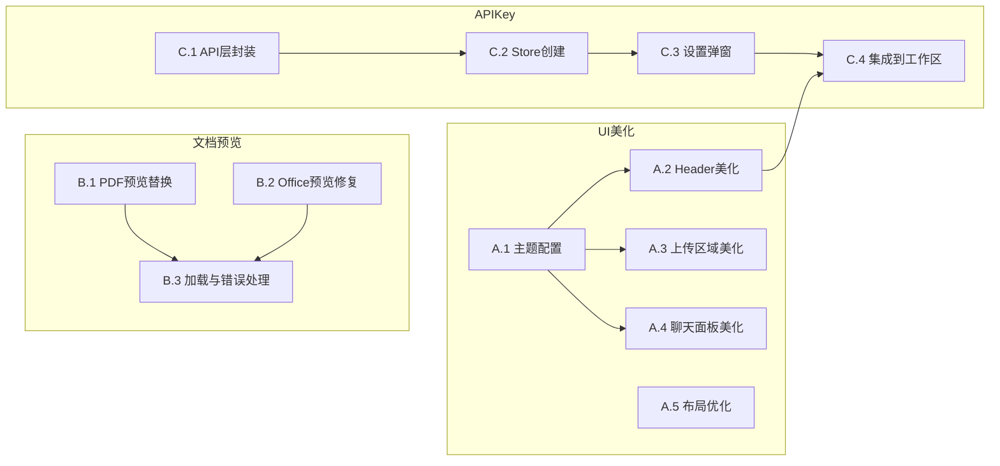

# 功能规划：UI 美化 + 文档预览修复 + API Key 配置页面

**规划时间**：2026-01-09
**预估工作量**：28 任务点

---

## 1. 功能概述

### 1.1 目标

本次迭代解决 Doc Studio 的三个核心问题：

1. **UI 美化**：提升整体视觉体验，建立统一的设计语言
2. **文档预览修复**：解决 PDF/Word/Excel 预览乱码问题
3. **API Key 配置**：为用户提供 LLM API Key 管理界面

### 1.2 范围

**包含**：
- Naive UI 主题配置（配色方案）
- Header 导航栏重新设计
- 上传区域视觉优化
- 聊天面板 UI 增强
- PDF 预览组件替换（iframe -> vue-pdf-embed）
- Office 文档预览数据格式修复（URL -> ArrayBuffer）
- API Key 设置弹窗组件
- API Key 列表展示（脱敏）
- 添加/删除 API Key 功能

**不包含**：
- 暗色主题（后续迭代）
- 多语言支持
- API Key 测试连通性功能
- 文档批量上传

### 1.3 技术约束

- **前端框架**：Vue 3.5 + Composition API
- **UI 组件库**：Naive UI 2.43（必须使用其主题系统）
- **样式方案**：Tailwind CSS 4.1（与 Naive UI 配合使用）
- **文档预览依赖**：
  - PDF：`vue-pdf-embed`（已安装）
  - Word：`@vue-office/docx`（已安装，需要 ArrayBuffer）
  - Excel：`@vue-office/excel`（已安装，需要 ArrayBuffer）
- **后端 API**：API Key 接口已存在，无需修改后端

---

## 2. WBS 任务分解

### 2.1 分解结构图

### 2.2 任务清单

---

#### 模块 A：UI 美化（10 任务点）

##### A.1 Naive UI 主题配置（2 点）

**文件**: `client/src/App.vue`、`client/src/config/theme.ts`（新建）

- [ ] **任务 A.1.1**：创建主题配置文件
  - **输入**：Naive UI 主题文档
  - **输出**：`theme.ts` 导出 `themeOverrides` 对象
  - **关键步骤**：
    1. 创建 `client/src/config/theme.ts`
    2. 定义主色调（推荐渐变蓝 `#2563eb` -> `#1d4ed8`）
    3. 配置 common 颜色变量（primaryColor, borderRadius 等）
    4. 配置组件级覆盖（Button, Input, Card 等）

- [ ] **任务 A.1.2**：应用主题到 App.vue
  - **输入**：`themeOverrides` 对象
  - **输出**：全局主题生效
  - **关键步骤**：
    1. 导入 `themeOverrides` 到 App.vue
    2. 传递给 `<n-config-provider :theme-overrides="themeOverrides">`
    3. 验证主题在各页面生效

##### A.2 Header 导航栏美化（2 点）

**文件**: `client/src/views/workspace/index.vue`

- [ ] **任务 A.2.1**：重新设计 Header 布局
  - **输入**：当前简陋的 Header
  - **输出**：美化后的导航栏
  - **关键步骤**：
    1. 添加 Logo 图标（使用 Naive UI Icon 或 SVG）
    2. 左侧：Logo + 应用名称
    3. 中间：文档名称显示（当前文档）
    4. 右侧：操作按钮组（导出、设置、用户菜单）
    5. 添加阴影效果 `shadow-sm`

- [ ] **任务 A.2.2**：优化用户下拉菜单
  - **输入**：当前 `<n-dropdown>` 配置
  - **输出**：带图标的下拉菜单
  - **关键步骤**：
    1. 为菜单项添加图标（使用 `@vicons/ionicons5`）
    2. 添加 "设置" 入口（触发 API Key 弹窗）
    3. 添加分割线区分功能区域

##### A.3 上传区域美化（2 点）

**文件**: `client/src/views/workspace/components/UploadZone.vue`

- [ ] **任务 A.3.1**：重新设计上传区域
  - **输入**：当前使用 emoji 的简陋设计
  - **输出**：现代化上传界面
  - **关键步骤**：
    1. 替换 emoji 为 SVG 图标或 Naive UI Icon
    2. 添加渐变背景或插图
    3. 优化文字层级（标题 + 副标题 + 提示）
    4. 使用 `<n-card>` 包裹，添加悬停效果
    5. 拖拽激活时添加动画效果

- [ ] **任务 A.3.2**：优化上传进度展示
  - **输入**：当前进度条
  - **输出**：更直观的进度反馈
  - **关键步骤**：
    1. 添加文件名显示
    2. 使用带百分比标签的进度条
    3. 添加上传成功/失败状态反馈

##### A.4 聊天面板美化（3 点）

**文件**: `client/src/views/workspace/components/ChatPanel.vue`

- [ ] **任务 A.4.1**：美化消息气泡
  - **输入**：当前简单的消息样式
  - **输出**：带头像和时间戳的气泡
  - **关键步骤**：
    1. 用户消息：添加用户头像（圆形缩写）
    2. AI 消息：添加机器人图标
    3. 调整气泡圆角和内边距
    4. 优化代码块样式（深色背景 + 语法高亮准备）
    5. 添加消息时间戳（可选显示）

- [ ] **任务 A.4.2**：优化输入区域
  - **输入**：当前输入框布局
  - **输出**：更现代的输入区
  - **关键步骤**：
    1. 输入框添加圆角和边框
    2. 发送按钮改为图标按钮
    3. 快捷操作按钮添加 tooltip
    4. 添加字数提示（可选）

- [ ] **任务 A.4.3**：添加空状态设计
  - **输入**：无消息时的空白
  - **输出**：引导性空状态
  - **关键步骤**：
    1. 设计空状态插图/图标
    2. 添加引导文案："开始与 AI 对话..."
    3. 显示快捷操作建议

##### A.5 工作区布局优化（1 点）

**文件**: `client/src/views/workspace/index.vue`

- [ ] **任务 A.5.1**：优化分栏布局
  - **输入**：当前固定比例布局
  - **输出**：可调节的分栏
  - **关键步骤**：
    1. 聊天面板切换按钮改为更明显的图标
    2. 添加面板展开/收起动画
    3. 优化无文档时的空状态

---

#### 模块 B：文档预览修复（8 任务点）

##### B.1 PDF 预览组件替换（3 点）

**文件**: `client/src/views/workspace/components/DocumentPreview.vue`

- [ ] **任务 B.1.1**：替换 iframe 为 vue-pdf-embed
  - **输入**：当前 `<iframe :src="previewUrl">` 实现
  - **输出**：使用 `<VuePdfEmbed>` 组件
  - **关键步骤**：
    1. 移除 PDF 的 iframe 渲染
    2. 导入 `import VuePdfEmbed from 'vue-pdf-embed'`
    3. 导入样式 `import 'vue-pdf-embed/dist/style/index.css'`
    4. 使用 `<VuePdfEmbed :source="pdfSource" />` 渲染
    5. `pdfSource` 需要是 ArrayBuffer 或 Base64

- [ ] **任务 B.1.2**：实现 PDF 数据获取
  - **输入**：后端 preview API 返回流
  - **输出**：ArrayBuffer 数据
  - **关键步骤**：
    1. 创建 `fetchPdfData(documentId)` 函数
    2. 使用 `axios` 请求，设置 `responseType: 'arraybuffer'`
    3. 添加 Authorization header
    4. 返回 ArrayBuffer 给组件

- [ ] **任务 B.1.3**：添加 PDF 翻页控制
  - **输入**：vue-pdf-embed 组件
  - **输出**：带翻页的 PDF 预览
  - **关键步骤**：
    1. 添加当前页/总页数显示
    2. 添加上一页/下一页按钮
    3. 添加页码跳转输入框
    4. 添加缩放控制（可选）

##### B.2 Office 文档预览数据修复（3 点）

**文件**: `client/src/views/workspace/components/DocumentPreview.vue`

- [ ] **任务 B.2.1**：修复 Word 预览
  - **输入**：当前传入 URL 导致乱码
  - **输出**：正常显示的 Word 文档
  - **关键步骤**：
    1. 分析 `@vue-office/docx` 组件 `src` prop 要求
    2. 创建 `fetchDocxData(documentId)` 函数
    3. 使用 `responseType: 'arraybuffer'` 获取数据
    4. 将 ArrayBuffer 传递给 `<VueOfficeDocx :src="docxData" />`

- [ ] **任务 B.2.2**：修复 Excel 预览
  - **输入**：当前传入 URL 导致乱码
  - **输出**：正常显示的 Excel 表格
  - **关键步骤**：
    1. 分析 `@vue-office/excel` 组件 `src` prop 要求
    2. 创建 `fetchExcelData(documentId)` 函数
    3. 使用 `responseType: 'arraybuffer'` 获取数据
    4. 将 ArrayBuffer 传递给 `<VueOfficeExcel :src="excelData" />`

- [ ] **任务 B.2.3**：统一数据获取逻辑
  - **输入**：各类型单独的获取函数
  - **输出**：统一的 `useDocumentPreview` 组合式函数
  - **关键步骤**：
    1. 创建 `client/src/hooks/useDocumentPreview.ts`
    2. 根据文档类型决定数据获取方式
    3. 统一管理加载状态和错误状态
    4. 导出 `{ data, loading, error, reload }`

##### B.3 加载状态与错误处理（2 点）

**文件**: `client/src/views/workspace/components/DocumentPreview.vue`

- [ ] **任务 B.3.1**：添加加载状态
  - **输入**：无加载指示
  - **输出**：骨架屏或 Spinner
  - **关键步骤**：
    1. 使用 `<n-spin>` 或 `<n-skeleton>` 显示加载中
    2. 根据文档类型显示不同的骨架屏形状
    3. 添加加载文案

- [ ] **任务 B.3.2**：添加错误处理
  - **输入**：预览失败时无反馈
  - **输出**：友好的错误提示
  - **关键步骤**：
    1. 使用 `<n-result status="error">` 显示错误
    2. 显示错误原因
    3. 添加重试按钮
    4. 记录错误日志（console）

---

#### 模块 C：API Key 配置页面（10 任务点）

##### C.1 API 层封装（2 点）

**文件**: `client/src/api/api-key.ts`（新建）

- [ ] **任务 C.1.1**：创建 API Key 接口封装
  - **输入**：后端 API 规范
  - **输出**：`apiKeyApi` 对象
  - **关键步骤**：
    1. 创建 `client/src/api/api-key.ts`
    2. 实现 `list(): Promise<ApiKey[]>`
    3. 实现 `create(dto: CreateApiKeyDto): Promise<ApiKey>`
    4. 实现 `remove(id: string): Promise<void>`

- [ ] **任务 C.1.2**：定义 DTO 类型
  - **输入**：后端 DTO 结构
  - **输出**：前端类型定义
  - **关键步骤**：
    1. 在 `client/src/types/index.ts` 添加 `CreateApiKeyDto`
    2. 字段：provider, key, baseUrl?
    3. 确保与后端 DTO 一致

##### C.2 API Key Store（2 点）

**文件**: `client/src/stores/api-key.ts`（新建）

- [ ] **任务 C.2.1**：创建 Pinia Store
  - **输入**：API 层函数
  - **输出**：`useApiKeyStore`
  - **关键步骤**：
    1. 创建 `client/src/stores/api-key.ts`
    2. 状态：`apiKeys: ApiKey[]`、`loading: boolean`
    3. Action：`fetchApiKeys`、`addApiKey`、`deleteApiKey`
    4. 处理加载和错误状态

##### C.3 设置弹窗组件（3 点）

**文件**: `client/src/components/settings/SettingsModal.vue`（新建）

- [ ] **任务 C.3.1**：创建设置弹窗骨架
  - **输入**：需求设计
  - **输出**：基础弹窗组件
  - **关键步骤**：
    1. 创建 `client/src/components/settings/SettingsModal.vue`
    2. 使用 `<n-modal>` 作为容器
    3. 添加标签页结构（为未来扩展预留）
    4. 第一个标签页：API Key 配置

- [ ] **任务 C.3.2**：实现 API Key 列表展示
  - **输入**：`apiKeys` 数据
  - **输出**：脱敏后的 Key 列表
  - **关键步骤**：
    1. 使用 `<n-data-table>` 或 `<n-list>` 展示
    2. 列：Provider 图标、脱敏 Key、Base URL、操作
    3. Provider 使用不同颜色标签区分
    4. 添加删除确认弹窗

- [ ] **任务 C.3.3**：实现添加 API Key 表单
  - **输入**：用户输入
  - **输出**：新增 API Key
  - **关键步骤**：
    1. 使用 `<n-form>` 创建表单
    2. Provider 下拉选择（OpenAI/Claude/Gemini/Custom）
    3. API Key 输入（密码类型）
    4. Base URL 输入（Custom 时必填，其他可选）
    5. 表单验证
    6. 提交后刷新列表

##### C.4 集成到工作区（3 点）

**文件**: `client/src/views/workspace/index.vue`

- [ ] **任务 C.4.1**：添加设置入口
  - **输入**：当前 Header
  - **输出**：设置按钮 + 弹窗触发
  - **关键步骤**：
    1. 在 Header 右侧添加设置图标按钮
    2. 或在用户下拉菜单中添加 "设置" 选项
    3. 点击触发 `showSettingsModal = true`

- [ ] **任务 C.4.2**：引入设置弹窗
  - **输入**：SettingsModal 组件
  - **输出**：工作区集成
  - **关键步骤**：
    1. 导入 SettingsModal 组件
    2. 添加 `<SettingsModal v-model:show="showSettingsModal" />`
    3. 在 `handleUserAction` 中处理 'settings' 事件

- [ ] **任务 C.4.3**：首次使用引导
  - **输入**：无 API Key 时的状态
  - **输出**：引导用户配置
  - **关键步骤**：
    1. 检测用户是否配置了 API Key
    2. 聊天面板显示 "请先配置 API Key" 提示
    3. 提供快捷跳转到设置的按钮

---

## 3. 依赖关系

### 3.1 依赖图

### 3.2 依赖说明

| 任务 | 依赖于 | 原因 |
|------|--------|------|
| A.2 Header美化 | A.1 主题配置 | Header 组件需要使用统一主题色 |
| A.3 上传区域美化 | A.1 主题配置 | 上传区域按钮需要主题色 |
| A.4 聊天面板美化 | A.1 主题配置 | 消息气泡需要主题色 |
| B.3 加载与错误处理 | B.1, B.2 | 需要先完成组件替换才能添加状态处理 |
| C.2 Store | C.1 API层 | Store 依赖 API 函数 |
| C.3 设置弹窗 | C.2 Store | 弹窗需要 Store 管理数据 |
| C.4 集成 | C.3, A.2 | 需要弹窗组件和美化后的 Header |

### 3.3 并行任务

以下任务可以并行开发：

**第一批（无依赖）**：
- A.1 主题配置
- B.1 PDF预览替换
- B.2 Office预览修复
- C.1 API层封装

**第二批**：
- A.2 Header美化 || A.3 上传区域美化 || A.4 聊天面板美化
- B.3 加载与错误处理
- C.2 Store创建

**第三批**：
- A.5 布局优化
- C.3 设置弹窗

**第四批**：
- C.4 集成到工作区

---

## 4. 实施建议

### 4.1 技术选型

| 需求 | 推荐方案 | 理由 |
|------|----------|------|
| 图标库 | `@vicons/ionicons5` | 与 Naive UI 配合良好，体积小 |
| PDF 预览 | `vue-pdf-embed` | 已安装，支持 ArrayBuffer，功能完善 |
| Office 预览 | `@vue-office/*` | 已安装，需传入 ArrayBuffer |
| 主题定制 | Naive UI Theme Overrides | 官方推荐，类型安全 |
| 颜色方案 | Blue 系（#2563eb） | 专业、稳重，适合文档工具 |

### 4.2 潜在风险

| 风险 | 影响 | 缓解措施 |
|------|------|----------|
| vue-pdf-embed 大文件性能 | 中 | 添加分页懒加载，限制同时渲染页数 |
| @vue-office 组件样式冲突 | 低 | 使用 scoped CSS 或 CSS Modules |
| ArrayBuffer 内存占用 | 中 | 预览完成后释放引用，使用 URL.revokeObjectURL |
| Tailwind 4.1 与 Naive UI 冲突 | 低 | 使用 Tailwind 前缀或在关键组件用 Naive UI 原生样式 |

### 4.3 测试策略

**单元测试**：
- `useDocumentPreview` hook 的数据获取逻辑
- `useApiKeyStore` 的 CRUD 操作
- 工具函数（文件大小格式化等）

**集成测试**：
- API Key 完整流程（添加 -> 列表展示 -> 删除）
- 文档上传 -> 预览完整流程

**E2E 测试**：
- 用户登录 -> 上传文档 -> 预览 -> 配置 API Key -> AI 对话

**手动测试重点**：
- 各类型文档预览（PDF、DOCX、XLSX、TXT、CSV）
- 大文件预览性能
- 主题在各页面的一致性

---

## 5. 验收标准

功能完成需满足以下条件：

### UI 美化
- [ ] 应用整体使用统一配色方案
- [ ] Header 包含 Logo、文档名、操作按钮
- [ ] 上传区域视觉现代化，拖拽有动画反馈
- [ ] 聊天气泡区分用户/AI，支持 Markdown 渲染
- [ ] 无明显样式错位或溢出

### 文档预览
- [ ] PDF 文档正常显示，支持翻页
- [ ] Word 文档正常显示，保留基本格式
- [ ] Excel 文档正常显示表格
- [ ] 加载过程有加载状态指示
- [ ] 预览失败显示友好错误提示

### API Key 配置
- [ ] 可通过设置入口打开配置弹窗
- [ ] 可查看已配置的 API Key（脱敏显示）
- [ ] 可添加新的 API Key（支持4种 Provider）
- [ ] 可删除已有 API Key
- [ ] 无 Key 时聊天面板有配置引导

### 代码质量
- [ ] TypeScript 类型完整，无 any 滥用
- [ ] 组件拆分合理，职责单一
- [ ] 无控制台错误或警告
- [ ] 代码遵循项目 ESLint 规范

---

## 6. 文件清单

### 新建文件

| 文件路径 | 职责 |
|----------|------|
| `client/src/config/theme.ts` | Naive UI 主题配置 |
| `client/src/api/api-key.ts` | API Key 接口封装 |
| `client/src/stores/api-key.ts` | API Key 状态管理 |
| `client/src/hooks/useDocumentPreview.ts` | 文档预览数据获取 |
| `client/src/components/settings/SettingsModal.vue` | 设置弹窗 |
| `client/src/components/settings/ApiKeyList.vue` | API Key 列表（可选拆分） |
| `client/src/components/settings/ApiKeyForm.vue` | 添加 Key 表单（可选拆分） |

### 修改文件

| 文件路径 | 修改内容 |
|----------|----------|
| `client/src/App.vue` | 应用主题配置 |
| `client/src/types/index.ts` | 添加 CreateApiKeyDto 类型 |
| `client/src/views/workspace/index.vue` | Header 美化、布局优化、集成设置弹窗 |
| `client/src/views/workspace/components/UploadZone.vue` | 上传区域美化 |
| `client/src/views/workspace/components/DocumentPreview.vue` | 预览组件重构 |
| `client/src/views/workspace/components/ChatPanel.vue` | 聊天面板美化 |

---

## 7. 后续优化方向（Phase 2）

- **暗色主题支持**：配置 dark mode 主题变量
- **API Key 测试**：添加 "测试连通性" 按钮
- **预览增强**：PDF 缩放、Word 目录导航
- **批量上传**：支持多文件拖拽上传
- **国际化**：多语言支持
- **响应式布局**：移动端适配
