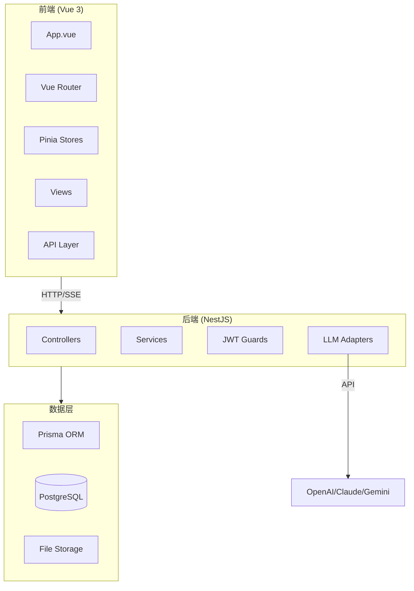
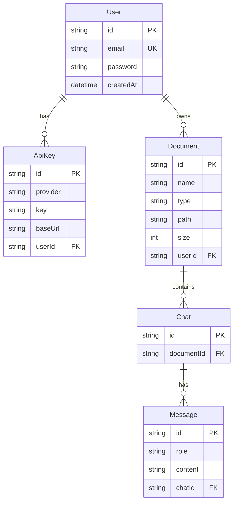

# Doc Studio

> 文档上传 → 保真预览 → 对话式续写改写 → 原格式导出

**生成时间**: 2026-01-09 14:57:33

## 项目概述

Doc Studio 是一个文档处理 Web 应用，支持多格式文档上传、在线预览、AI 对话式编辑和原格式导出。

## 技术架构



## 技术栈

| 层级 | 技术 | 版本 |
|------|------|------|
| 前端框架 | Vue 3 + Vite | 3.5.x / 7.2.x |
| UI 组件 | Naive UI | 2.43.x |
| 样式 | Tailwind CSS | 4.1.x |
| 状态管理 | Pinia | 3.0.x |
| 后端框架 | NestJS | 11.x |
| ORM | Prisma | 7.2.x |
| 数据库 | PostgreSQL | - |
| 认证 | JWT + bcrypt | - |
| 文档预览 | vue-pdf-embed, @vue-office/* | - |

## 目录结构

```
doc-studio/
├── client/                 # 前端 Vue 应用
│   ├── src/
│   │   ├── api/           # API 请求封装
│   │   ├── components/    # 通用组件
│   │   ├── hooks/         # 组合式函数
│   │   ├── layouts/       # 布局组件
│   │   ├── router/        # 路由配置
│   │   ├── stores/        # Pinia 状态
│   │   ├── types/         # TypeScript 类型
│   │   └── views/         # 页面视图
│   └── package.json
├── server/                 # 后端 NestJS 应用
│   ├── src/
│   │   ├── common/        # 通用模块
│   │   ├── modules/       # 业务模块
│   │   └── prisma.service.ts
│   ├── prisma/
│   │   └── schema.prisma  # 数据库模型
│   └── package.json
└── CLAUDE.md              # 本文件
```

## 模块索引

| 模块 | 路径 | 职责 |
|------|------|------|
| [client](./client/CLAUDE.md) | `/client` | Vue 3 前端应用 |
| [server](./server/CLAUDE.md) | `/server` | NestJS 后端服务 |

## 数据模型



## API 端点

| 方法 | 路径 | 描述 | 认证 |
|------|------|------|------|
| POST | `/api/auth/register` | 用户注册 | - |
| POST | `/api/auth/login` | 用户登录 | - |
| GET | `/api/auth/me` | 获取当前用户 | JWT |
| GET | `/api/documents` | 文档列表 | JWT |
| POST | `/api/documents/upload` | 上传文档 | JWT |
| GET | `/api/documents/:id` | 获取文档详情 | JWT |
| GET | `/api/documents/:id/preview` | 获取预览 | JWT |
| GET | `/api/documents/:id/export` | 导出原格式 | JWT |
| POST | `/api/chat/:docId/message` | 发送消息 (SSE) | JWT |
| GET | `/api/api-keys` | API Key 列表 | JWT |
| POST | `/api/api-keys` | 添加 API Key | JWT |

## 开发命令

```bash
# 前端开发
cd client && npm run dev

# 后端开发
cd server && npm run start:dev

# 数据库迁移
cd server && npx prisma migrate dev

# 构建
cd client && npm run build
cd server && npm run build
```

## 环境变量

### Server (.env)
```
DATABASE_URL=postgresql://...
JWT_SECRET=your-secret
```

## 实施进度

- [x] 项目初始化
- [x] 认证模块 (JWT)
- [x] 文档上传/预览
- [x] LLM 适配器架构
- [ ] SSE 流式响应完善
- [ ] 文档导出功能
- [ ] 上下文管理优化
